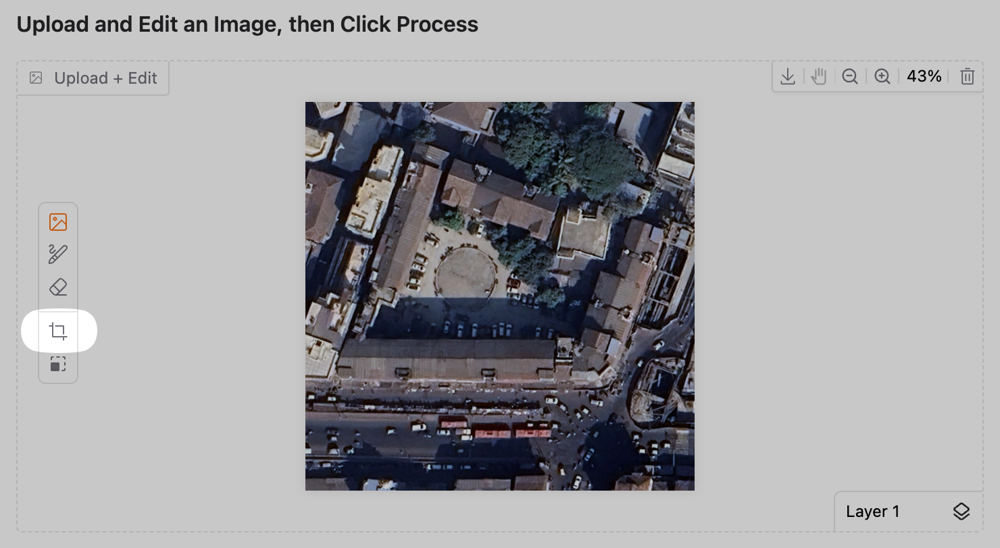

## Project Details

Topic 29: Segment an image by dynamic thresholding approach, with Otsu thresholding as the basis thresholding method.

### Team Members:
- **Desai Utsav Manojkumar** (200100054)  
- **Ashutosh Mulchandani** (200100037)  
- **Saurabh Neerat** (22B2122)  


# Image Thresholding Demo: Global vs. Dynamic Otsu

This project demonstrates and compares two image thresholding techniques: Global Otsu and Dynamic (Local) Otsu. It includes a custom implementation of dynamic thresholding and an interactive Gradio application for visualization.


## Methodology

* **Global Otsu:** Determines a single optimal threshold for the entire image by analyzing the global intensity histogram (implemented using OpenCV).
* **Dynamic (Local) Otsu:** Calculates a unique threshold for each pixel based on the pixels within a local window (block) around it (custom implementation). This adapts the threshold to local variations.

## The Gradio Application (Demo)

The project includes a Gradio app (`app.py`) to interactively compare these methods:

* View precomputed results on example images.
* Upload your own image and apply Global or Dynamic Otsu.
* Cropping option available as shown in the below image.

<div style="text-align: center;">
    
</div>

* Adjust the `block_size` parameter using slider for Dynamic Otsu.

* **Demo URL:**
    https://huggingface.co/spaces/scriea/GNR602-Demo


## Getting Started (Local)

1.  **Clone the repository:**
    ```bash
    git clone https://github.com/utsav-desai/GNR602.git
    cd GNR602
    ```
2.  **Install dependencies:**
    ```bash
    pip install -r utils/requirements.txt
    ```
3.  **Running locally:**
    * Choose one image to process from `images/`.
    * Run `main.ipynb` after editing the image_file variable according to the path of the image to process to generate corresponding global and dynamic results.
    * Precomputed results visible in the `outputs/` directory.
4.  **Run the demo:** 
    ```bash
    gradio app.py
    ```

## Project Structure

```text
.
├── images/          # Original input images
├── outputs/         # Precomputed thresholded results
├── utils/           # Helper files
├── app.py           # Demo code
└── main.ipynb       # Running code locally
```